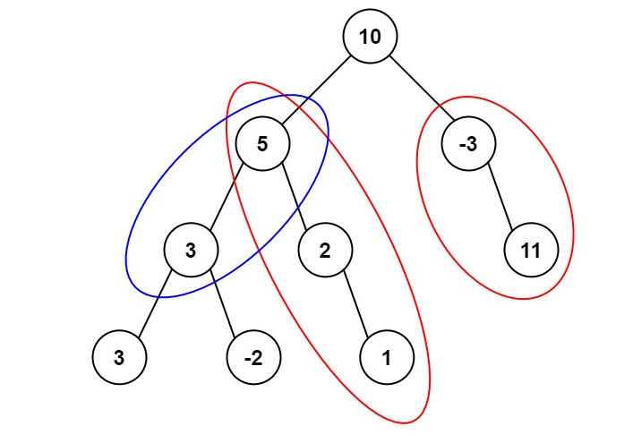

### 前缀和介绍：

​	该算法需要开辟一个比原数组的大小大一个内存的数组

​	它的每一个元素意义是：**前原数组n个元素的总和**。也就是说下标为3的元素，是原来前三个元素的和。（也可以理解为除了自己以外的前面元素的和）。

​	前缀和算法是一种用空间换时间的算法，他常常用于解决某些题目或者作为某些高级算法的组成部分。

### 应用：

#### 437. 路径总和 III

##### 题目描述

给定一个二叉树的根节点 `root` ，和一个整数 `targetSum` ，求该二叉树里节点值之和等于 `targetSum` 的 **路径** 的数目。

**路径** 不需要从根节点开始，也不需要在叶子节点结束，但是路径方向必须是向下的（只能从父节点到子节点）。

**示例 1：**



```
输入：root = [10,5,-3,3,2,null,11,3,-2,null,1], targetSum = 8
输出：3
解释：和等于 8 的路径有 3 条，如图所示。
```

**示例 2：**

```
输入：root = [5,4,8,11,null,13,4,7,2,null,null,5,1], targetSum = 22
输出：3
```

**提示:**

- 二叉树的节点个数的范围是 `[0,1000]`
- `-109 <= Node.val <= 109` 
- `-1000 <= targetSum <= 1000` 

##### 分析

​	可以采用深度优先遍历，记录从根节点到当前节点的和、根节点的下一个节点到当前节点的和、....父节点到当前节点的和。然后遍历这些节点，加上当前节点值判断是否等于目标值。

​	采用前缀和解法只记录前缀和，然后计算当前节点时，想要看从根节点到当前节点的任意连续路径和是否等于 $$targetSum$$ 时

​	只需要计算从 $$根节点到当前节点的前缀和 - targetSum$$ 是否存在于所有前缀和中即可。

比如：

 已知 $$root,node1,node2,node3,...,currentNode$$的所有前缀和，存在$$map[prefix]$$中，且从root到$$currentNode$$的和为$$curr$$

然后计算当前$$currentNode$$时，计算 $$curr(总前缀和) - targetSum$$ 是否存在于上述 prefix中，

如果存在，假设是从$$root$$到$$nodeL$$的和，那么说明从$$nodeL$$ 到 $$currentNode$$的和等于$$targetSum$$

这样就把前面方法一中需要不断维护从根节点到当前节点的所有连续路径和$$O(n) $$改进为 $$O(1)$$了

~~~ java
		public int pathSum3(TreeNode root, int targetSum) {
        Map<Long, Integer> prefix = new HashMap<Long, Integer>();
        prefix.put(0L, 1);
        return dfs(root, prefix, 0, targetSum);
    }

    public int dfs(TreeNode root, Map<Long, Integer> prefix, long curr, int targetSum) {
        if (root == null) {
            return 0;
        }

        int ret = 0;
        curr += root.val;
				// 获取当前前缀和和目标值的差值
        ret = prefix.getOrDefault(curr - targetSum, 0);
      	// 将当前前缀和值+1
        prefix.put(curr, prefix.getOrDefault(curr, 0) + 1);
      	// 获取左子树的总解法 
        ret += dfs(root.left, prefix, curr, targetSum);
      	// 获取右子树的总解法 
        ret += dfs(root.right, prefix, curr, targetSum);
      	// 将当前前缀和值-1
        prefix.put(curr, prefix.getOrDefault(curr, 0) - 1);

        return ret;
    }
~~~


