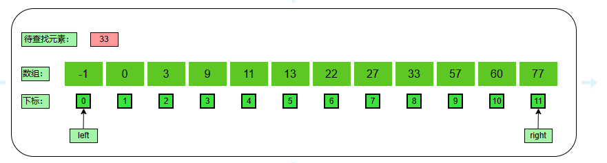
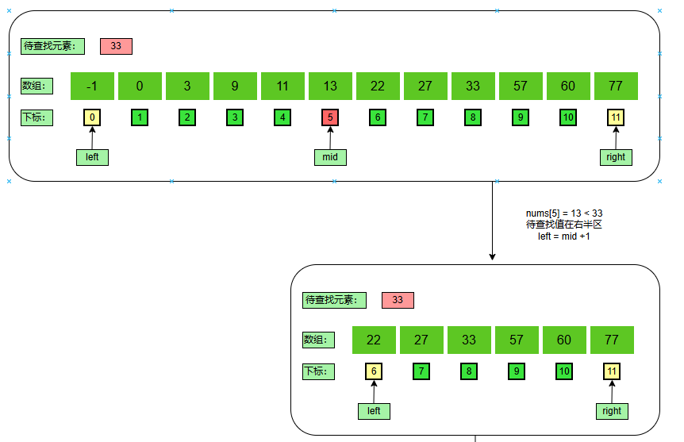
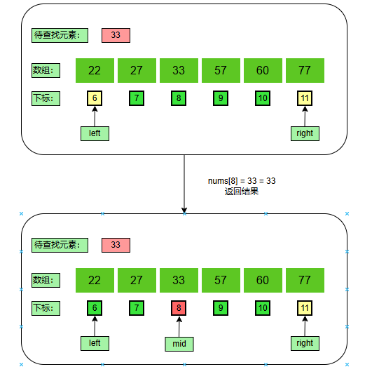

### 分析：

​	二分查找每次计算完数组中间值，与待查找元素对比之后，会使下一次待查找的区间减半，所以二分查找属于比较经典的减治。

**过程如下：**

​	1、取有序序列的中间值与待查找值比较。

​	2、若中间值与待查找值相同则查找成功。

​	3、若中间值比待查找值小，则在中间记录的左边区间查找。

​	4、若中间值比待查找值大，则在中间记录的右边区间查找。

 	5、重复上述1~4过程，直到查找成功或区间无记录。

### 过程图解：

**1、初始化**

​	有序数组：{ -1、0、3、9、11、13、22、27、55、57、60、77 }

​	待查找元素： 33

​	初始化：左下标为0（left = 0）、右下标为11（right=11）

**2、第一趟比较**

计算中间值：

​								$$ mid = left + (right - left) / 2 = 0 + (11 - 0) / 2 = 5$$

减少规模：

​	$$nums[5] = 13 < 33$$，带查找值在数组右半区，则 $$left = mid + 1 = 5 + 1 = 6$$。

**3、第二躺比较**

计算中间值：

​								$$ mid = left + (right - left) / 2 = 6 + (11 - 6) / 2 = 8$$

得到结果：

​	$$nums[8] = 33 = 33$$，找到带查找值在数组中的下标8，查找结束。

### 代码实现：

~~~ java
    public static int execute(int[] data, int key) {
        int leftIndex = 0, rightIndex = data.length - 1;
        int midIndex = -1;
        // 当左下标不再小于右下标，说明区间内已经没有元素，即数组内没有待查找元素
        while (leftIndex < rightIndex) {
            midIndex = (rightIndex - leftIndex) / 2 + leftIndex;
            // 找到就直接返回
            if (data[midIndex] == key) {
                return midIndex;
            //中间值小于待查找值，待查找值在数组右半区域
            } else if (data[midIndex] < key) {
                leftIndex = midIndex + 1;
            //中间值大于待查找值，待查找值在数组左半区域
            } else {
                rightIndex = midIndex - 1;
            }
        }
        return data[midIndex] == key ? midIndex : -1;
    }
~~~

