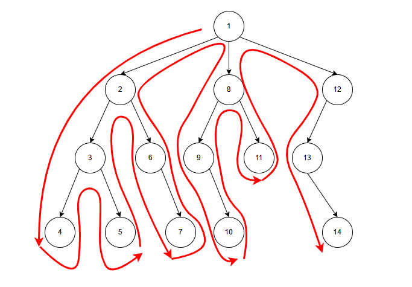

### 基本思想：

​	回溯法是一种系统地搜索问题解空间的算法，常用于解决组合优化和约束满足问题。其核心思想是**利用深度优先搜索**逐步构建可能的解，同时在搜索过程中进行**剪枝**操作，以排除那些无法满足问题约束或不能产生最优解的分支，从而减少不必要的计算，提高搜索效率。

#### 深度优先搜索（DFS）简介：

​	对于二叉树来说，先序、中序、后序遍历都是深度优先遍历。

​	深度优先就是一条路径走到底后，再返回上一步，搜索第二条路径。

### 回溯法的一般步骤

1.定义问题并构造状态空间树

​	明确要解决的问题，确定解空间的结构（通常是一个树或图），确定每一步决策的选择范围。

​	将问题的解空间表示为一棵树，树的每个节点表示一个状态，根节点表示初始状态，叶节点表示最终状态或解。

2.编写递归函数

​	编写一个递归函数来遍历状态空间树，函数通常包括以下部分：

- **递归边界**：定义何时到达叶节点，即找到一个解或无法继续深入。
- **选择和判断（剪枝）**：在当前状态下，尝试每一种可能的选择，并判断是否满足约束条件。
- **递归调用**：如果满足条件，则进行递归调用，进入下一个状态。
- **回溯**：如果不满足条件，或递归调用返回后，需要撤销当前选择，回溯到上一步继续尝试其他选择。

3.输出结果

### 举例

#### 问题描述：

​	有n个物品，它们有各自的体积和价值，现有给定容量的背包，如何让背包里装入的物品具有最大的价值总和？

背包体积：10

| 物品编号 | 体积(vol) | 价值(val) |
| :------: | :-------: | :-------: |
|    1     |     8     |     9     |
|    2     |     3     |     2     |
|    3     |     4     |     4     |
|    4     |     3     |     3     |

​	前面在动态规划中，说了一下蛮力法的如何解决该问题，实际上回溯法与蛮力法差不多，只是搜索方式不同，并添加剪枝（提前结束当前遍历）和回溯（记忆之前的状态）。

#### 1、定义问题并构造状态空间树

​	前面使用蛮力法解决时，对于问题的每一种状态通过数值的二进制表示，用数字二进制中为1的位置表示该位置的物品是否放入，比如：

​	1（0000 0001）表示第1个物品放入，其他都不放入；

​	2（0000 0010）表示第2个物品放入，其他都不放入；

​	3（0000 0011）表示第1和第2哥物品放入，其他都不放入。

​	使用回溯法解决问题，需要将问题所有的情况构造成一颗树或图，通过深度优先搜索遍历获取最优解。

​	每个物品只有两种状态，放入背包或不放入背包，可以将各种物品是否放入构造成一颗二叉树，如下图：

#### 2、选择和判断（剪枝）

​	边界：当当前物品为最后一个物品时，则到达叶子节点，递归结束。

​	选择：每一步递归，针对当前物品，都存在放与不放两个选择。

​	剪枝：如果放入当前物品，通过判断放入后当前物品的总体积是否超过总体积，如果超过就进行剪枝。

​	回溯：当当前状态的所有情况考虑完之后，进行回溯。

**剪枝：**

​	在第一个物品放入，第二个物品尝试放入时，发现放入第二个物品后，体积变为：8+3=11> 背包体积=10，所以，在第一、第二个物品放入，无论剩下的物品怎么放，都会超出背包体积，此时进行剪枝，减少了大量的计算。

​	对比蛮力法：对于1100、1101、1110、1111这四种情况，其都会去计算一次，发现超出背包容量再结束，而回溯则在计算1100时，发现超出背包容量就直接剪枝，后面的其他几种情况都不再计算。

**回溯：**

​	在计算了0111这种情况后，进行回溯，到达011这一步，然后计算0110，直接使用了011这一步的状态（当前体积7，当前价值6），在这个基础上计算0110。

​	对比蛮力法：在计算了0111后，再次计算0110这种情况时，还需要计算011的体积和价值，然而这一步在计算0111时，011状态的体积和价值就已经计算过了，蛮力法进行了重复计算，而回溯法则保存了之前的状态，减少了重复计算。

#### 3、输出结果

​		在递归过程中，更新最大价值，最终输出，

#### 4、代码实现

​	不需要真的去构建这颗二叉树，通过递归模拟二叉树即可。

~~~ java
public class ZeroOneBackpackBacktrack {
    private static int maxValue = 0;
    public static void main(String[] args) {
        int maxVolume = 10;
        Item[] items = new Item[]{
                new Item(8, 9),
                new Item(3, 2),
                new Item(4, 4),
                new Item(3, 3)};
        execute(items, maxVolume);
        System.out.println(maxValue);
    }

    public static void execute(Item[] items, int maxVolume) {
        zeroOneBackpackBacktrack(items, maxVolume, 0, 0, 0);
    }

    public static void zeroOneBackpackBacktrack(Item[] items, int maxVolume, int index, int currentVolume, int currentValue) {
        // 当前体积已经超出背包最大体积
        if (currentVolume > maxVolume) return;
        // 更新最大价值
        maxValue = Math.max(currentValue, maxValue);
        // 未到达最后一个物品
        if (index < items.length) {
            // 放入当前物品
            zeroOneBackpackBacktrack(items, maxVolume, index + 1, currentVolume + items[index].getVolume(), currentValue + items[index].getValue());
            // 不放入当前物品
            zeroOneBackpackBacktrack(items, maxVolume, index + 1, currentVolume, currentValue);
        }
    }
}

class Item {
    int volume;
    int value;
    public Item(int volume, int value) {
        this.volume = volume;
        this.value = value;
    }
    public int getValue() {
        return value;
    }
    public int getVolume() {
        return volume;
    }
}

~~~

