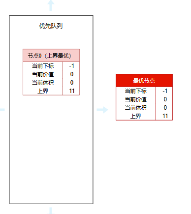
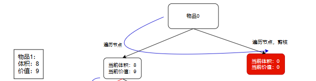
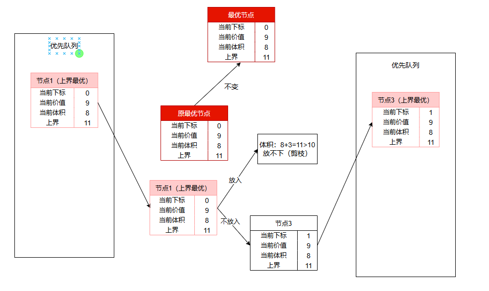
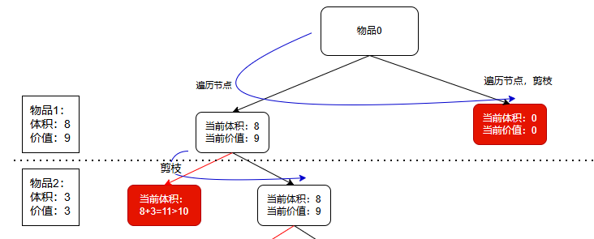
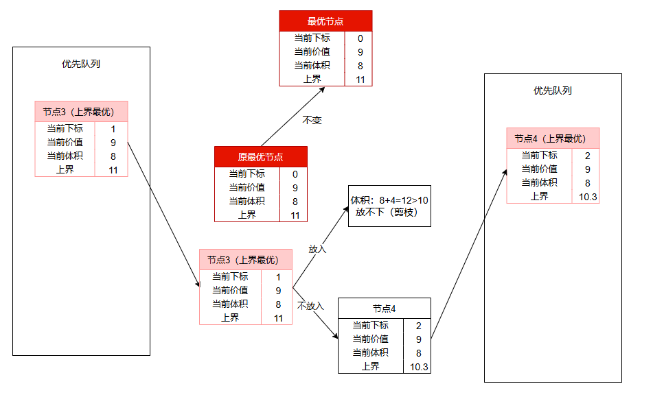
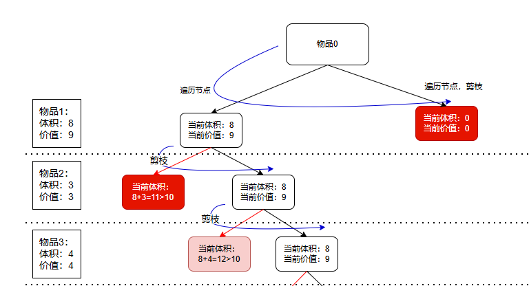
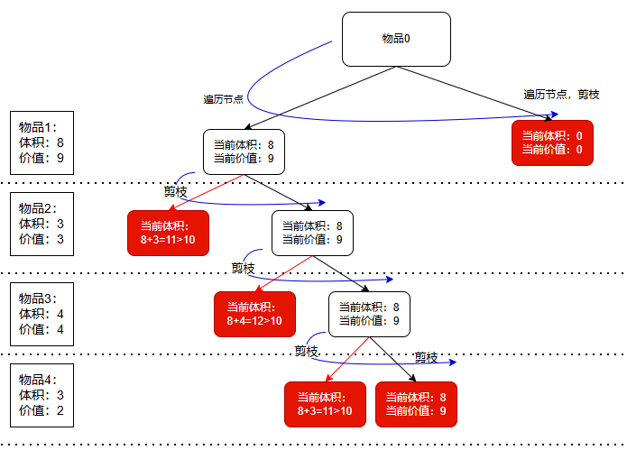

### 问题描述：

​	有n个物品，它们有各自的体积和价值，现有给定容量的背包，如何让背包里装入的物品具有最大的价值总和？

背包体积：10

| 物品编号 | 体积(vol) | 价值(val) |
| :------: | :-------: | :-------: |
|    1     |     8     |     9     |
|    2     |     3     |     2     |
|    3     |     4     |     4     |
|    4     |     3     |     3     |

### 步骤介绍：

**大致思想：**

​	首先将问题的所有解构造成一个二叉树。

​	从第一个节点开始，以广度优先策略搜索其所有子节点。

​	然后对子节点解通过限界函数计算理论上的最大值，然后剪枝，最后加入队列

​	然后从队列里选择预期价值最高的节点继续重复上述过程，直到找到最优解。

#### 1.定义问题并构造状态空间树

​	每个物品只有两种状态，放入背包或不放入背包，可以将各种物品是否放入构造成一颗二叉树。这一点在回溯法介绍01背包问题时，已经介绍过 。

#### 2.确定节点的存储结构。

​	从队列里选择节点时，肯定是选取预期价值（也就是根据限界函数算出来的上界）最高的节点，那么就应该使用优先队列（按照预期价值排序）。

​	而节点应该存储如下信息：

~~~
		index：当前已经遍历过的物品下标。
​		currentVolume：当前节点选取的物品总体积。
​		currentValue：当前节点选取的物品总价值
​		items：当前节点选取的物品
​		upperBound：当前节点在后续选择节点中的上界
~~~

#### 3.确定界限函数

​	分支限界法在遍历过程中根据限界函数估算某节点的上界或下界。根据要求，这个函数既要简单，还要能尽可能准确的计算出节点的边界以保证可以尽早剪枝。

​	如果已经将物品按照单位体积的价值进行排序，那么尽可能的拿到单位体积价值大的物品应该更贴切节点的上界，即使用贪心法获取节点上界。

~~~java
    /**
     * 计算界限
     * @param node 待计算节点
     * @param items 物品数组
     * @param maxVolume 最大体积
     * @return 带计算节点的上界
     */
    private static double getBound(Node node, List<Item> items, int maxVolume) {
        int tempVolume = node.getCurrentVolume();// 当前节点体积
        int tempValue = node.getCurrentValue();// 当前节点价值
        int i = node.getIndex() + 1;// 从下一个节点开始，使用贪心
        while ((i < items.size()) && tempVolume + items.get(i).getVolume() <= maxVolume) {
            tempVolume += items.get(i).getVolume();
            tempValue += items.get(i).getValue();
        }
        // 背包体积未装满但又装不下下一个节点，因为是计算上界，所以直接将下一个物品掰开，只取一部分装满背包
        if ((tempVolume < maxVolume) && (i < items.size())) {
            return tempValue + (maxVolume - tempVolume) * items.get(i).getValuePerVolume();
        }
        return tempValue;
    }
~~~

#### 4.初始化：初始化根节点和界限值。

​	为了尽可能拿到最大价值的物品，在选择物品时，应该尽可能先拿单位体积价值最大的物品，所以需要将物品按照单位体积价值进行排序。

排序后：

| 物品编号 | 体积(vol) | 价值(val) |
| :------: | :-------: | :-------: |
|    1     |     8     |     9     |
|    2     |     3     |     3     |
|    3     |     4     |     4     |
|    4     |     3     |     2     |

对于根节点来说，应该是一个物品都没遍历，当前的体积价值都为0，上界使用贪心法：

​	放入第一个物品 { 体积=8，价值=9}

​	放第二个物品，体积=8+3=11>10，将第二个物品掰开取部分{体积=10，价值=$$9 + (3/3)*(10-8)=11$$}

~~~java
  // 初始化第一个节点以及优先队列
  PriorityQueue<Node> queue = new PriorityQueue<>(Comparator.comparingDouble(Node::getUpperBound).reversed());
  Node firstNode = new Node();
  firstNode.setIndex(-1);
  firstNode.setCurrentValue(0);
  firstNode.setCurrentVolume(0);
  firstNode.setUpperBound(getBound(firstNode, items, maxVolume));
  queue.add(firstNode);
~~~

#### 5.循环处理每个节点，直到所有节点处理完或剪枝，找到最优解：

​	5.1 分支：每个节点的子节点就两个，放入下一个节点或不放下一个节点

~~~ java
while (!queue.isEmpty()) {
  // 获取预期价值最大的节点
  Node currentNode = queue.poll();
	// 放入当前节点
  quene.add(inNode);// 初始化放入节点
  // 不放入当前节点
  quene.add(outNode);// 初始化不放入节点
}
~~~

​	5.2 限界：通过限界函数获取当前节点的预期最大价值

~~~ java
// 因为使用贪心法计算上界，放入的话，当前节点上界就跟父节点一样
inNode.setUpperBound(currentNode.getUpperBound());
// 计算不放入的上界
outNode.setResult(currentNode.getResult());
~~~

​	5.3 剪枝：

​		当前节点的预期最大价值已经小于了当前的最优解，剪枝；

​		当前节点已经遍历了最后一个物品，结束；

​		当前节点放入下一个物品体积超出背包最大体积，剪枝；

~~~ java
  // 放入当前节点
  if (currentNode.getCurrentVolume() + currentItem.getVolume() <= maxVolume) {
    Node inNode = new Node();//初始化省略
    // 因为使用贪心法计算上界，放入的话，当前节点上界就跟父节点一样
    inNode.setUpperBound(currentNode.getUpperBound());
    queue.add(inNode);
  }
  // 不放入
  Node outNode = new Node();//初始化省略
  double bound = getBound(outNode, items, maxVolume);
  // 不放入的话，计算出来上界小于当前最优解，剪枝
  if (bound > maxNode.getCurrentValue()) {
    outNode.setUpperBound(bound);
    queue.add(outNode);
  }
~~~

​	5.4 更新：不放入下一个节点，那么新节点的价值就与父节点一致，所以不需要更新最优解

~~~ java
// 只有放入下一个节点，价值才会变，所以只有这种情况才会更新
if (inNode.getCurrentValue() > maxNode.getCurrentValue()) maxNode = inNode;
~~~

​	5.5 选择下一个节点：两个节点遍历完，按照优先队列，取预期价值最高的节点

~~~ java
// 获取预期价值最大的节点
Node currentNode = queue.poll();
~~~

6.输出最优解

​	当队列里没有节点，说明全部都小于了最优解，直接输出

```java
System.out.println(maxNode);//maxNode的items记录了选择了哪些物品
```

### 步骤图片详解：(极端例子)

排序后物品数组：

| 物品编号 | 体积(vol) | 价值(val) |
| :------: | :-------: | :-------: |
|    1     |     8     |     9     |
|    2     |     3     |     3     |
|    3     |     4     |     4     |
|    4     |     3     |     2     |

**1、初始化**

​	通过上界函数计算出第一个节点的上界：

​	放入第一个物品 { 体积=8，价值=9}

​	放第二个物品，体积=8+3=11>10，将第二个物品掰开取部分{体积=10，价值=$$9 + (3/3)*(10-8)=11$$}



接下来循环：

​	取出队列中预期价值最高节点，以广度优先遍历两个节点（放入下一个节点和不放入），并更新最优解

**2、第一轮循环：取出节点0**

​	放入上限：与父节点一致，11，更新最优节点价值为9

​	计算不放入上限：体积{$$3+4+3=10$$} 上界{$$3+4+2=9$$}，例子比较极端 9=9（最优节点价值），剪枝


对于解空间树而言：

​	遍历第一个物品放入的节点；

​	遍历第一个物品不放入节点，直接剪枝。



**2、第二轮循环：取出节点1**

​	放入：8+3=11>10，超出背包体积，剪枝

​	不放入：体积{$$8+4=12>10$$} 上界{$$9+(10-8)*(4/4)=11$$}



对于解空间树：

​	遍历第二个物品放入的节点，直接剪枝；

​	遍历第二个物品不放入节点。

​	

**3、第三轮循环：取出节点3**

​	放入：8+4=12>10，超出背包体积，剪枝

​	不放入：体积{$$8+3=12>10$$} 上界{$$9+(10-8)*(2/3)=10.3333$$}



对于解空间树：

​	遍历第二个物品放入的节点，直接剪枝；

​	遍历第二个物品不放入节点。



**4、第三轮循环：取出节点4**

​	放入：8+3=11>10，超出背包体积，剪枝

​	不放入：因为已经是最后一个物品，所以上界就是当前价值 = 9 = 9（最优节点价值），剪枝


对于解空间树：

​	遍历第二个物品放入的节点，直接剪枝；

​	遍历第二个物品不放入节点，剪枝。




**结论：**

​	可见，分支限界法每次会按照广度优先策略搜索当前节点的子节点，并且根据限界函数提前剪枝，直接在最开始就去除了一个分支，减少了大量的计算。


完整代码：

~~~ java
package branchBound;

import java.util.*;

/**
 * @author: gj
 * @description: TODO
 */
public class ZeroOneBackpack2 {
    public static void main(String[] args) {
        int maxVolume = 8;
        List<Item> items = new ArrayList<>(Arrays.asList(
                new Item(2, 3),
                new Item(3, 4),
                new Item(4, 5),
                new Item(5, 6)));
        execute(items, maxVolume);

        int maxVolume2 = 10;
        List<Item> items2 = new ArrayList<>(Arrays.asList(
                new Item(8, 9),
                new Item(3, 2),
                new Item(3, 3),
                new Item(4, 4)));
        execute(items2, maxVolume2);

        int maxVolume3 = 15;
        List<Item> items3 = new ArrayList<>(Arrays.asList(
                new Item(12, 24),
                new Item(7, 13),
                new Item(11, 23),
                new Item(9, 20),
                new Item(8, 15)));
        execute(items3, maxVolume3);
    }

    public static void execute(List<Item> items, int maxVolume) {
        // 将物品按照单位体积价值排序
        items.sort(Comparator.comparingDouble(Item::getValuePerVolume).reversed());
        // 初始化第一个节点以及优先队列
        PriorityQueue<Node> queue = new PriorityQueue<>(Comparator.comparingDouble(Node::getUpperBound).reversed());
        Node firstNode = new Node();
        firstNode.setIndex(-1);
        firstNode.setCurrentValue(0);
        firstNode.setCurrentVolume(0);
        firstNode.setUpperBound(getBound(firstNode, items, maxVolume));
        queue.add(firstNode);
        Node maxNode = firstNode;
        while (!queue.isEmpty()) {
            // 获取预期价值最大的节点
            Node currentNode = queue.poll();
            // 已经全部放入
            if (currentNode.getIndex() == items.size() - 1) {
                if (currentNode.getCurrentValue() > maxNode.getCurrentValue()) {
                    maxNode = currentNode;
                }
                continue;
            }
            Item currentItem = items.get(currentNode.getIndex() + 1);
            // 放入当前节点
            if (currentNode.getCurrentVolume() + currentItem.getVolume() <= maxVolume) {
                Node inNode = new Node();
                inNode.setIndex(currentNode.getIndex() + 1);
                inNode.setCurrentVolume(currentNode.getCurrentVolume() + currentItem.getVolume());
                inNode.setCurrentValue(currentNode.getCurrentValue() + currentItem.getValue());
                inNode.setItems(currentNode.getItems() + " " + currentItem);
                // 因为使用贪心法计算上界，放入的话，当前节点上界就跟父节点一样
                inNode.setUpperBound(currentNode.getUpperBound());
                queue.add(inNode);
                if (inNode.getCurrentValue() > maxNode.getCurrentValue()) maxNode = inNode;
            }
            // 不放入
            Node outNode = new Node();
            outNode.setIndex(currentNode.getIndex() + 1);
            outNode.setCurrentVolume(currentNode.getCurrentVolume());
            outNode.setCurrentValue(currentNode.getCurrentValue());
            outNode.setItems(currentNode.getItems());
            double bound = getBound(outNode, items, maxVolume);
            // 不放入的话，计算出来上界小于当前最优解，剪枝
            if (bound > maxNode.getCurrentValue()) {
                outNode.setUpperBound(bound);
                queue.add(outNode);
            }
        }
        System.out.println(maxNode);
    }

    /**
     * 计算界限
     * @param node 待计算节点
     * @param items 物品数组
     * @param maxVolume 最大体积
     * @return 带计算节点的上界
     */
    private static double getBound(Node node, List<Item> items, int maxVolume) {
        int tempVolume = node.getCurrentVolume();// 当前节点体积
        int tempValue = node.getCurrentValue();// 当前节点价值
        int i = node.getIndex() + 1;// 从下一个节点开始，使用贪心
        while ((i < items.size()) && tempVolume + items.get(i).getVolume() <= maxVolume) {
            tempVolume += items.get(i).getVolume();
            tempValue += items.get(i).getValue();
            i++;
        }
        // 背包体积未装满但又装不下下一个节点，因为是计算上界，所以直接将下一个物品掰开，只取一部分装满背包
        if ((tempVolume < maxVolume) && (i < items.size())) {
            return tempValue + (maxVolume - tempVolume) * items.get(i).getValuePerVolume();
        }
        return tempValue;
    }
}

class Node {
    int index;
    int currentVolume;
    int currentValue;
    String items = "";
    double upperBound;

    public Node() {
    }

    public Node(int index, int currentVolume, int currentValue, String items, double upperBound) {
        this.index = index;
        this.currentVolume = currentVolume;
        this.currentValue = currentValue;
        this.items = items;
        this.upperBound = upperBound;
    }

    public int getIndex() {
        return index;
    }

    public void setIndex(int index) {
        this.index = index;
    }

    public int getCurrentVolume() {
        return currentVolume;
    }

    public void setCurrentVolume(int currentVolume) {
        this.currentVolume = currentVolume;
    }

    public int getCurrentValue() {
        return currentValue;
    }

    public void setCurrentValue(int currentValue) {
        this.currentValue = currentValue;
    }

    public String getItems() {
        return items;
    }

    public void setItems(String items) {
        this.items = items;
    }

    public double getUpperBound() {
        return upperBound;
    }

    public void setUpperBound(double upperBound) {
        this.upperBound = upperBound;
    }

    @Override
    public String toString() {
        return "取物品：" + items + ";" + "最大值：" + currentValue;
    }
}


public class Item {
    /**
     * 体积
     */
    int volume;
    /**
     * 价值
     */
    int value;

    public double getValuePerVolume() {
        return value * 1.0 / volume;
    }

    public Item(int volume, int value) {
        this.volume = volume;
        this.value = value;
    }

    public int getValue() {
        return value;
    }

    public int getVolume() {
        return volume;
    }

    @Override
    public String toString() {
        return "Item{" +
                "volume=" + volume +
                ", value=" + value +
                '}';
    }
}
~~~

