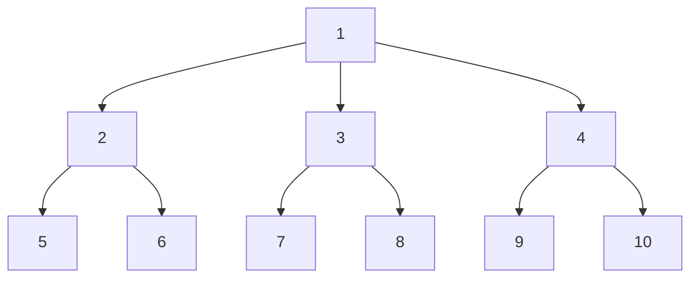

### 基本思想：

​	分支限界法按**广度优先策略**搜索问题的解空间树。

​	在搜索过程中，对待处理的节点剪枝后按照限界函数估算上界或下届，然后从所有的节点中取得极值（极大或极小）的节点后再按照广度优先策略搜索。

​	通过上述操作不断调整搜索方向，最终找到最优解。

具体来说：

​	在分支限界法中，每一个活结点只有一次机会成为扩展结点。

​	活结点一旦成为扩展结点，就一次性产生其所有儿子结点。在这些儿子结点中，导致不可行解或导致非最优解的儿子结点被舍弃，其余儿子结点被加入活结点表中。

​	此后，从活结点表中取下一结点成为当前扩展结点，并重复上述结点扩展过程。这个过程一直持续到找到所需的解或活结点表为空时为止。

所以，下面三个重要的概念就容易理解了：

**分支：**按照广度优先，从当前节点生成所有可能的子节点，每个子节点代表部分解的一个扩展。

**限界：**通过限界函数计算当前部分解的下界或上界，用于评估该部分解的潜在最优性。

**剪枝：** 如果当前部分解的限界值（下界或上界）不优于已知的最佳解，则剪枝，不再继续扩展该部分解。这可以显著减少需要探索的节点数量，提高搜索效率。

**节点的常见存储方式：**

​	队列式(FIFO)分支限界法：按照队列先进先出（FIFO）原则选取下一个节点为扩展节点。

​	优先队列式分支限界法：按照优先队列中规定的优先级选取优先级最高的节点成为当前扩展节点。

**分支限界法与回溯法的不同：**

（1）求解目标：回溯法的求解目标是找出解空间树中满足约束条件的**所有解**，而分支限界法的求解目标则是找出满足约束条件的一个解，或是在满足约束条件的解中找出在某种意义下的**最优解**。

（2）搜索方式的不同：回溯法以深度优先的方式搜索解空间树，而分支限界法则以广度优先或以最小耗费优先的方式搜索解空间树。

### 分支限界法一般步骤：

1.定义问题并构造状态空间树

​	明确要解决的问题，确定解空间的结构（通常是一个树或图）。

​	将问题的解空间表示为一棵树，树的每个节点表示一个状态，根节点表示初始状态，叶节点表示最终状态或解。

2.确定节点的存储结构：即确定是使用队列（先进先出）还是优先队列（规定优先级）

3.确定限界函数：

​	分支限界法在遍历过程中根据限界函数估算某节点的上界或下界。那么：

​		这个限界函数应该计算简单，因为每个节点都要计算 ，如果这个函数计算复杂，那么会导致整体速度变慢。

​		这个函数更重要的作用是尽可能准确，以保证可以在搜索的早期对超出界限的节点进行剪枝。

4.初始化：初始化根节点和界限值。

5.循环处理每个节点，直到所有节点处理完或剪枝，找到最优解：

​	5.1 分支：按照广度优先策略生成当前节点的子节点。

​	5.2 限界：计算当前部分解的下界或上界，用于评估其潜在的最优性。

​	5.3 剪枝：根据限界函数得到的上界或下界进行剪枝。

​	5.4 更新：当前节点优于最优解时，就更新当前最优解。

​	5.5 选择下一个节点

6.输出最优解

