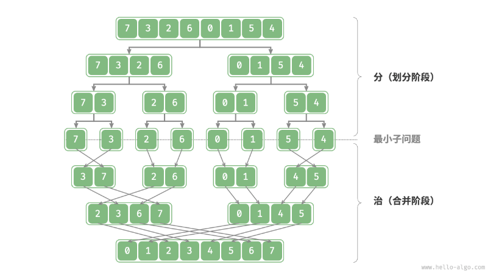
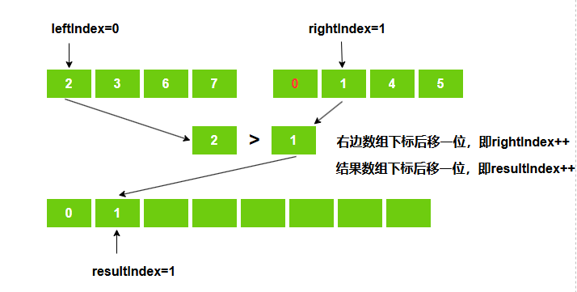
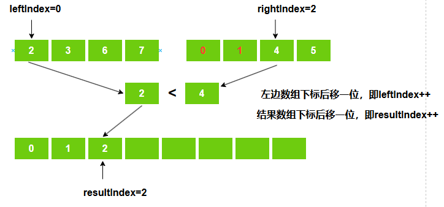
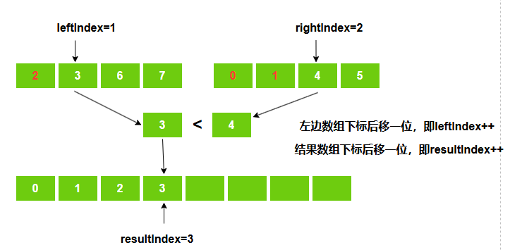
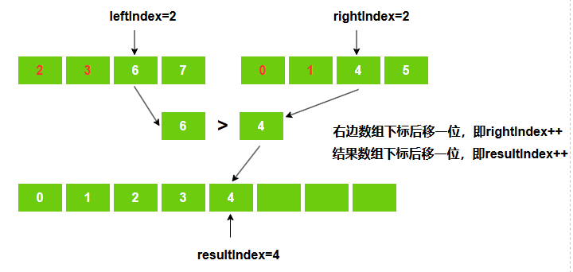
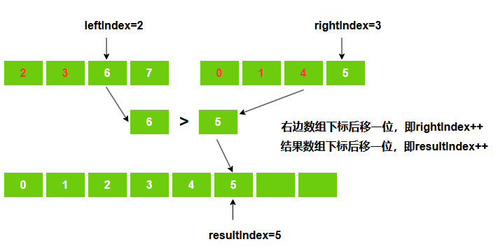
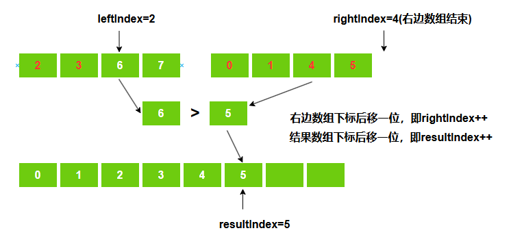
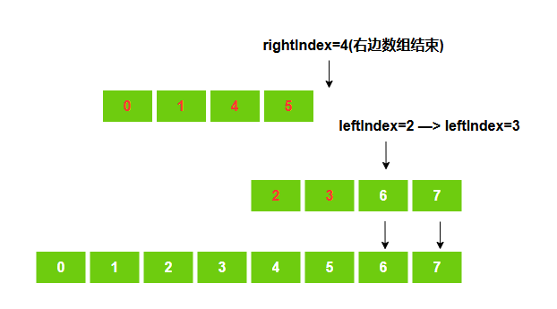
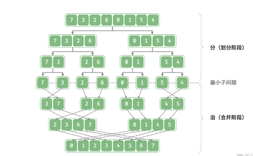

### 分析：

对于一个无序数组，对其进行排序，其满足分治的三个要求：

1. **问题可以分解**：递归地将数组（原问题）划分为两个子数组（子问题）。
2. **子问题是独立的**：每个子数组都可以独立地进行排序（子问题可以独立进行求解）。
3. **子问题的解可以合并**：两个有序子数组（子问题的解）可以合并为一个有序数组（原问题的解）。

### 过程图解：

​	使用递归不断的对原数组进行划分，直到划分为最小子问题（单个元素，单个元素一定是有序的）。

​	然后再依次合并子数组，将其合并为一个较大的有序数组。

前面说过，**分治算法的效率很大程度上依赖合并的实现**，这里合并如何实现是比较重要的。

**合并数组操作：**

​	两个子数组从下标0开始，依次比较，拿出其中较小的放入合并后数组中。

​	最后将剩余子数组的数据依次放入结果数组中。

以上面 {2、3、6、7} 与 {0、1、4、5} 两个有序子数组合并为例：

1、初始化

​	左边数组、右边数组、合并后数组都从下标0开始，即 `leftIndex = rightIndex = resulrIndex = 0`

2、第一趟比较

​	右边数组下标`rightIndex=0`的位置值小于左边数组下标`leftIndex=0`位置的值。

​	先将右边数组下标`rightIndex=0`的位置值放入结果数组中，然后右边数组下标向后移动一位，结果数组下标向后移动，左边数组下标不动。

​	即`result[resultIndex++] = right[RightIndex++]`。

​	

3、第二趟比较

​	右边数组下标`rightIndex=1`的位置值小于左边数组下标`leftIndex=0`位置的值。

​	先将右边数组下标`rightIndex=1`的位置值放入结果数组中，然后右边数组下标向后移动一位，结果数组下标向后移动，左边数组下标不动。

​	即`result[resultIndex++] = right[RightIndex++]`。

4、第三趟比较

5、第四躺比较

6、第五躺比较

7、第六躺比较

8、第7躺比较

​	此时，右边数组遍历结束，左边数组还有剩余。

​	此时依次将左边数组中数据放入结果数组。

9、最后

### 时间复杂度分析：

归并排序的时间复杂度是 $O(n\log_2n)$。具体分析如下：

1. **分解阶段**：将数组分成两个子数组，每次分解的时间是常数级别的，总共需要分解 $\log_2n$ 次。
2. **合并阶段**：每次合并两个子数组的时间是线性级别的，总共有 $\log_2n$层，每层合并的时间是 $O(n)$。

因此，总时间复杂度为： $O(n\log_2n)$.

如下图：

​	在合并部分，每一层其实都需要比较n次，共有 $\log_2n$层。

### 代码实现：

~~~ java
    /**
     * @param data 待排序数组
     * @param left 待排序数组起始下标
     * @param right 待排序数组终止下标
     * @return
     */
    public static int[] execute(int[] data, int left, int right) {
        // 达到最小子问题，即只有一个元素，那么这个元素一定是有序的
        if (left == right) {
            return new int[]{data[left]};
        }
        /**
         * 定义临时变量
         * midIndex:数组中间值，即将数组划分为 left -> midIndex 和 midIndex+1 -> right 两部分
         * leftIndex：合并两个有序子数组时，记录 left -> midIndex 数组的下标
         * rightIndex：合并两个有序子数组时，记录 midIndex+1 -> right 数组的下标
         * resultIndex：合并两个有序子数组时，记录 合并后有序数组 的下标
         */
        int midIndex = (right - left) / 2 + left, 
                leftIndex = 0, rightIndex = 0, resultIndex = 0;
        // 递归求解 left -> midIndex 部分，使这部分有序
        int[] leftResult = execute(data, left, midIndex);
        // 递归求解 midIndex+1 -> right 部分，使这部分有序
        int[] rightResult = execute(data, midIndex + 1, right);
        // 存储合并后的有序数组
        int[] result = new int[right - left + 1];
        // 合并
        while (leftIndex < leftResult.length && rightIndex < rightResult.length) {
            result[resultIndex++] = 
                    leftResult[leftIndex] <= rightResult[rightIndex] ? 
                            leftResult[leftIndex++] : rightResult[rightIndex++];
        }
        // left -> midIndex 部分有剩余，依次填入合并后有序数组
        while (leftIndex < leftResult.length) {
            result[resultIndex++] = leftResult[leftIndex++];
        }
        // midIndex+1 -> right 部分有剩余，依次填入合并后有序数组
        while (rightIndex < rightResult.length) {
            result[resultIndex++] = rightResult[rightIndex++];
        }
        return result;
    }

~~~

