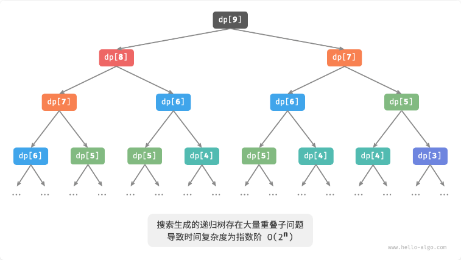
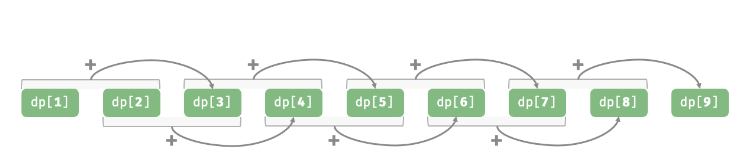

### 动态规划基本思想

​	动态规划将一个问题分解为若干个互相重叠的子问题，并通过存储子问题的解来避免重复计算，从而大幅提升时间效率。

​	跟分治有些类似（“**分**”与“**合**”体现在 **状态转移方程**），但是通常这些子问题都相互重叠。

​	所以动态规划的重点就是找到这个递推关系，即较小规模问题如何推断出更大问题的解。

### 判断一个问题是否可以使用动态规划解决

**1、最优子结构**

​	原问题的最优解是从子问题的最优解构建得来的。

​	从状态的角度理解，就是后面阶段的状态可以由前面阶段的状态推导出来。

**2、无后效性**

​	给定一个确定的状态，它的未来发展只与当前状态有关，而与过去经历的所有状态无关。

​	换句话说，各个子问题的只与它前面的子问题的解相关。而且各子问题的解都是相对于当前状态的最优解，整个问题的最优解是由各个子问题的最优解构成。

**3、重叠子问题**

​	重叠子问题是指在问题的求解过程中，会反复遇到相同的子问题。这些子问题可能在不同的情况下多次出现，但其解决方法是相同的。

### 动态规划求解过程

**1、划分子问题（定义初始状态）**

​	将原问题分解为若干个子问题，每个子问题对应一个决策阶段，并且这些子问题直接具有重叠关系。这一步主要就是定义初始状态。

**2、确定动态规划函数（状态转移方程）**

​	找出最优子结构，然后根据子问题直接的重叠关系找到子问题之间的递推关系，这一步是动态规划的关键。

**3、填表**

​	设计表格，自底向上计算各个子问题的解并填写DP表。

### 数学归纳法

​	其实，动态规划的思想就像**是数学归纳法**的思想，状态转移方程就像是数学归纳法的递推函数，定义初始状态就像是数学归纳法中的初始状态一样。

简单回顾一下数学归纳法：

证明前n项和$$S(n) = 1 + 2 + 3  ….  +  n = n*(n + 1) / 2 $$

1、确定初始状态：$$n = 1, S(1)  = 1 = 1*(1+1) /2$$

2、确定递推关系 $$S(n) = n*(n + 1) / 2 $$

​	假设n=n时命题成立，那么对于n+1来说：

​			$$S(n  + 1) =  S(n) + n + 1= n(n + 1)/2 + n + 1= (n + 1)[(n + 1)+1]/ 2$$

所以

​	$$S(n) = n*(n + 1) / 2 $$

### 举例：

#### **1、问题描述：**

爬楼梯（斐波那契数列）：

​	给定一个共有 𝑛 阶的楼梯，你每步可以上 1 阶或者 2 阶，请问有多少种方案可以爬到楼顶？

#### **2、分析：**

​	由于每轮只能上 1 阶或 2 阶，因此当我们站在第 𝑖 阶楼梯上时，上一轮只可能站在第 𝑖−1 阶或第 𝑖−2 阶上。

​	换句话说，我们只能从第 𝑖−1 阶或第 𝑖−2 阶迈向第 𝑖 阶。

由此便可得出一个重要推论：

​	**爬到第 𝑖−1 阶的方案数加上爬到第 𝑖−2 阶的方案数就等于爬到第 𝑖 阶的方案数**。

**公式如下：**

​	$$dp[i]=dp[i-1]+dp[i-2]$$

而其中第一阶有1种方案，第二阶楼梯有两种方案，即：

​	 $$dp[1]=1, dp[2]=2$$

#### **3、暴力搜索**

​	这样就可以通过递归不断的**将一个较大问题拆解为两个较小问题的和**，直至到达最小子问题 𝑑𝑝[1] 和 𝑑𝑝[2] 时返回。

~~~ java
int climbingStairsDFS(int n) {
    // 已知 dp[1] 和 dp[2] ，返回
    if (i == 1 || i == 2)
        return i;
    int count = dfs(i - 1) + dfs(i - 2);
    return count;
}
~~~

#### **4、动态规划**

​	观察上图 ，**指数阶的时间复杂度是“重叠子问题”导致的**。例如 𝑑𝑝[9] 被分解为 𝑑𝑝[8] 和 𝑑𝑝[7] ，𝑑𝑝[8] 被分解为 𝑑𝑝[7] 和 𝑑𝑝[6] ，两者都包含子问题 𝑑𝑝[7] 。

​	以此类推，子问题中包含更小的重叠子问题。绝大部分计算资源都浪费在这些重叠的子问题上。

**分析：**

​	可以发现，这个问题具有最优子结构、无后效性、重叠子问题的三个特点的，那么就可以尝试使用动态规划进行解决。

划分子问题，定义初始状态：

​	原问题$$dp[n]$$可以被划分为求解$$dp[n-1]$$和$$dp[n-2]$$的解。

​	初始状态为 $$dp[1]=1,dp[2]=2$$

确定动态规划函数（状态转移方程）：

​	$$dp[i]=dp[i-1]+dp[i-2]$$

接下来填表即可：

~~~ java
int climbingStairsDP(int n) {
    if (n == 1 || n == 2)
        return n;
    // 初始化 dp 表，用于存储子问题的解
    int[] dp = new int[n + 1];
    // 初始状态：预设最小子问题的解
    dp[1] = 1;
    dp[2] = 2;
    // 状态转移：从较小子问题逐步求解较大子问题
    for (int i = 3; i <= n; i++) {
        dp[i] = dp[i - 1] + dp[i - 2];
    }
    return dp[n];
}
~~~

