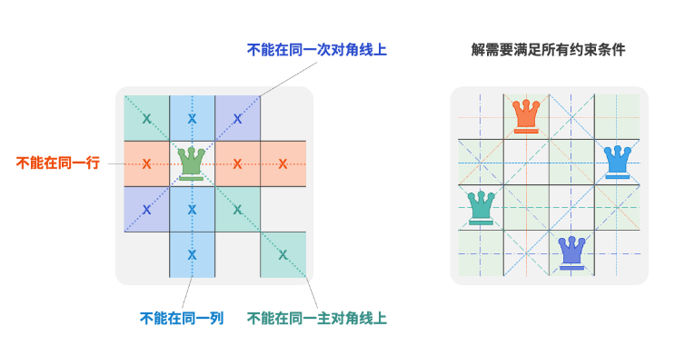
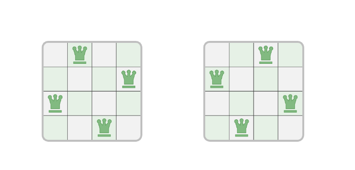
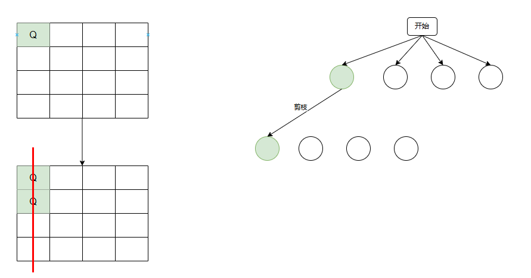
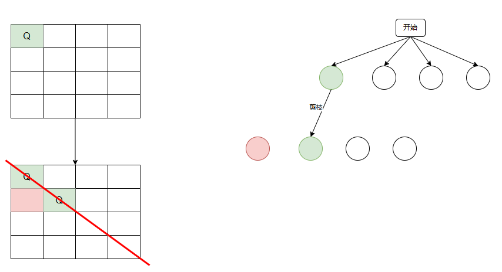
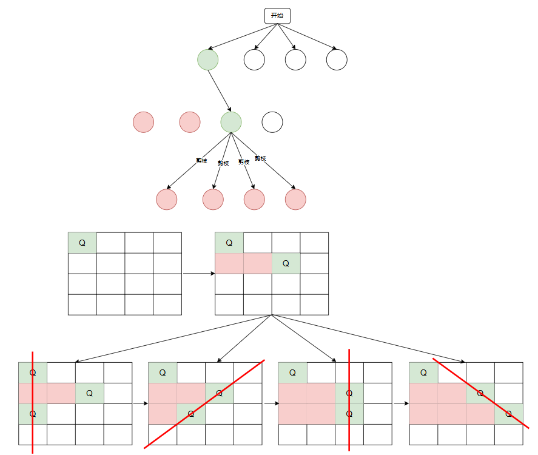
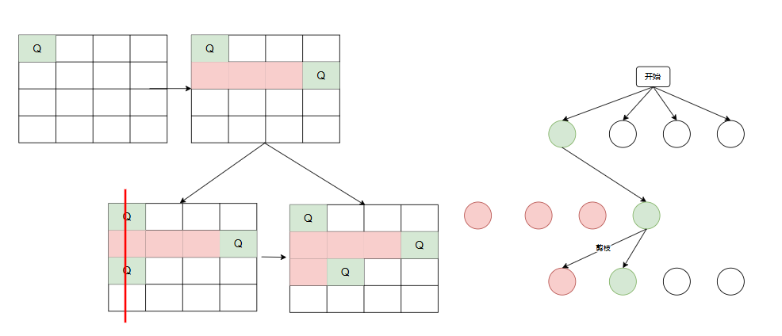
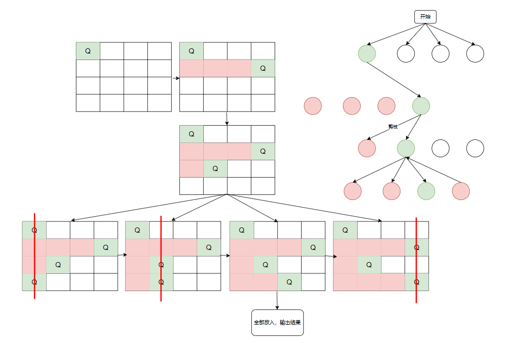
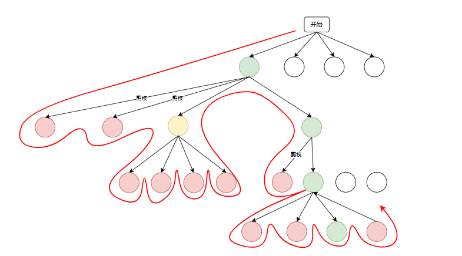
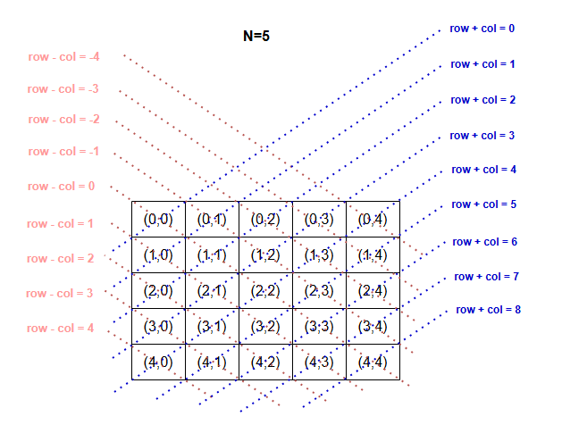

### 问题描述：

​	根据国际象棋的规则，皇后可以攻击与同处一行、一列或一条斜线上的棋子。给定 𝑛 个皇后和一个 𝑛×𝑛 大小的棋盘，寻找使得所有皇后之间无法相互攻击的摆放方案。

例如：

​	对于n = 4 的情况，有下面两种可能的摆放方法。

​	



### 蛮力法：

​	蛮力法只需要将所有的情况都遍历到即可，对于每一行，尝试在每一列放置一个皇后，生成所有可能的放置方案。

​	每一行有n列，一共n行，遍历每种情况就需要$$n*n*n...*n = n^n$$次，再加上每一次都要判断所有的皇后位置是否正确，又需要遍历。所以复杂度特别高。

~~~ java
    public static void nQueens(int[][] data, int row) {
        int n = data.length;
        // 已经到达最后一行，n个皇后已经放置完毕
        if (row == n) {
            // 校验皇后拜访位置是否合理
            for (int row1 = 0; row1 < n; row1++) {
                for (int col = 0; col < n; col++) {
                    if (data[row1][col] == 1) {
                        // 判断每一行中皇后位置是否合理
                        if (!canPlace(data, row1, col)) {
                            // 不合理直接返回
                            return;
                        } else {
                            // 到达最后一行输出结果
                            if (row1 == n - 1) {
                                System.out.println("第" + ++num + "组解：");
                                for (int[] d : data) {
                                    System.out.println(Arrays.toString(d));
                                }
                            }
                        }
                    }
                }
            }
        }else{
            // 未到达最后一行，遍历
            for (int col = 0; col < n; col++) {
                data[row][col] = 1;
                nQueens(data, row + 1);
                data[row][col] = 0;
            }
        }
    }

    public static boolean canPlace(int[][] data, int row, int col) {
        // 检查同一列是否有皇后
        for (int i = 0; i < row; i++) {
            if (data[i][col] == 1) return false;
        }
        // 检查 \ 对角线是否存在皇后
        for (int i = 1; row - i >= 0 && col - i >= 0; i++) {
            if (data[row - i][col - i] == 1) return false;
        }
        // 检查 / 对角线是否存在皇后
        for (int i = 1; row - i >= 0 && col + i < data.length; i++) {
            if (data[row - i][col + i] == 1) return false;
        }
        return true;
    }
~~~


### 回溯法：

#### 1、定义问题并构造状态空间树

​	根据棋盘大小$$n*n$$和$$n$$个皇后，以及皇后可以攻击与其处于同一行上的其他皇后可知，每一行仅允许放置一个皇后。可以按照逐行放置的思路：从第一行开始，在每行放置一个皇后，直至最后一行结束。

​	那么每一行实际上就有n个选择，每个位置是否放入皇后，放入皇后之后，就可以进入下一行放置下一个皇后。

​	采用一个n叉树就可以表示，这里使用一个二维数组表示：

~~~ java
    public static void dfs(int[][] data, int row) {
        for (int col = 0; col < data.length; col++) {
                // 放入皇后
                data[row][col] = 1;
                // 放入下一个皇后
                dfs(data, row + 1);
                // 取出当前皇后(回溯):每一行只能放置一个，取出当前列皇后，下一列放入
                data[row][col] = 0;
            }
        }
    }
~~~

#### 2、选择和判断（剪枝）

​	在某一行的某一列放置皇后时，可能会出现如果该位置放置皇后，就会与前几行放置的皇后冲突，那么就可以提前剪枝，直接不用放置后续的皇后了，直接去尝试再下一列放置。

~~~ java
	public static void dfs(int[][] data, int row) {
        for (int col = 0; col < data.length; col++) {
            // 剪枝:判断该位置是否可以放入，不可放入则直接终止
            if (canPlace(data, row, col)) {
                // 放入皇后
                data[row][col] = 1;
                // 放入下一个皇后
                dfs(data, row + 1);
                // 取出当前皇后(回溯):每一行只能放置一个，取出当前列皇后，下一列放入
                data[row][col] = 0;
            }
        }
    }

	public static boolean canPlace(int[][] data, int row, int col) {
        // 检查同一列是否有皇后
        for (int i = 0; i < row; i++) {
            if (data[i][col] == 1) return false;
        }
        // 检查 \ 对角线是否存在皇后
        for (int i = 1; row - i >= 0 && col - i >= 0; i++) {
            if (data[row - i][col - i] == 1) return false;
        }
        // 检查 / 对角线是否存在皇后
        for (int i = 1; row - i >= 0 && col + i < data.length; i++) {
            if (data[row - i][col + i] == 1) return false;
        }
        return true;
    }
~~~

#### 3、输出结果

​	当放置到最后一行时，此时所有皇后均放入，可以输出结果

~~~ java
	public static void dfs(int[][] data, int row) {
        // 最后一个皇后已经放入
        if (row == data.length) {
            printResult(data, ++resultNum);
            return;
        }
        for (int col = 0; col < data.length; col++) {
            // 剪枝:判断该位置是否可以放入，不可放入则直接终止
            if (canPlace(data, row, col)) {
                // 放入皇后
                data[row][col] = 1;
                // 放入下一个皇后
                dfs(data, row + 1);
                // 取出当前皇后(回溯):每一行只能放置一个，取出当前列皇后，下一列放入
                data[row][col] = 0;
            }
        }
    }
	public static void printResult(int[][] data, int num) {
        System.out.println("第" + num + "组解：");
        for (int i = 0; i < data.length; i++) {
            System.out.println(Arrays.toString(data[i]));
        }
    }
~~~

#### 图解说明：

​	因为八皇后如果画图篇幅过大，这里用四皇后讲解：

​	其中白色表示尚未遍历，绿色表示放入皇后，红色表示被剪枝（此路不通）

1、给第一行第一列放入皇后，进入第二行在第二行第一列放入皇后，剪枝



2、放入第二行第二列，剪枝



3、放入第二行第三列，皇后可以放置，再尝试放入第三行



4、第二行第三列放入皇后的所有情况均被剪枝，放入第二行第四列

​	放入第三行第一列时剪枝，放入第三行第二列



5、第三行确定后，放入第四行（最后一个皇后）

​	可见，在第四行第三列放入皇后时，符合要求，直接输出结果，其他几种情况均不符合情况



6、回溯，计算第三行放入第三列的情况

7、重复上述步骤

具体流程下图：

​	可以看到，这其实就是深度优先搜索，添加了剪枝



#### 优化：

​	上面在判断某个位置是否可以放置皇后时，使用的计算过方式需要遍历，会导致每次计算时复杂度较高。

```java
public static boolean canPlace(int[][] data, int row, int col) {
        // 检查同一列是否有皇后
        for (int i = 0; i < row; i++) {
            if (data[i][col] == 1) return false;
        }
        // 检查 \ 对角线是否存在皇后
        for (int i = 1; row - i >= 0 && col - i >= 0; i++) {
            if (data[row - i][col - i] == 1) return false;
        }
        // 检查 / 对角线是否存在皇后
        for (int i = 1; row - i >= 0 && col + i < data.length; i++) {
            if (data[row - i][col + i] == 1) return false;
        }
        return true;
    }
```


可以改为如下方式:

​	可以利用一个长度为 𝑛 的布尔型数组 `existCol` 记录每一列是否有皇后。在每次决定放置前，我们通过 `cols` 将已有皇后的列进行剪枝，并在回溯中动态更新 `cols` 的状态。

那么，如何处理对角线约束呢？

​	设棋盘中某个格子的行列索引为 (𝑟𝑜𝑤,𝑐𝑜𝑙) ，选定矩阵中的某条主对角线，我们发现该对角线上所有格子的行索引减列索引都相等，**即对角线上所有格子的 𝑟𝑜𝑤−𝑐𝑜𝑙 为恒定值**。

​	也就是说，如果两个格子满足 𝑟𝑜𝑤1−𝑐𝑜𝑙1=𝑟𝑜𝑤2−𝑐𝑜𝑙2 ，则它们一定处在同一条主对角线上。利用该规律，我们可以借助如图所示的数组 `existLeftDiagonal` 记录每条主对角线上是否有皇后。

​	容易看出，记录某一列是否有皇后的数组`existLeftDiagonal`长度为`2N-1`。

​	

同理，**次对角线上的所有格子的 𝑟𝑜𝑤+𝑐𝑜𝑙 是恒定值**。我们同样也可以借助数组 `existRightDiagonal` 来处理次对角线约束。

```java
public static boolean canPlace(int row, int col, int n, boolean[] existCol, boolean[] existLeftDiagonal, boolean[] existRightDiagonal) {
        return !(existCol[col] || 
                 existLeftDiagonal[row - col + n - 1] || 
                 existRightDiagonal[row + col]);
    }
```

完整代码：

```java
package backtracking;

import java.util.Arrays;

public class EightQueens2 {
    private static int num = 0;

    public static void main(String[] args) {
        execute(9);
    }

    public static void execute(int n) {
        // 皇后存在情况表
        int[][] data = new int[n][n];
        // 皇后存在列情况
        boolean[] existCol = new boolean[n];
        // 皇后存在对角线 \ 情况 (可以发现处于同一对角线的元素，行 - 列是同一个值，所以可以使用这个性质来存储对角线信息)
        boolean[] existLeftDiagonal = new boolean[2 * n - 1];
        // 皇后存在对角线 / 情况(可以发现处于同一对角线的元素，行+ 列是同一个值，所以可以使用这个性质来存储对角线信息)
        boolean[] existRightDiagonal = new boolean[2 * n - 1];
        dfs(data, n, 0, existCol, existLeftDiagonal, existRightDiagonal);
    }

    private static void dfs(int[][] data, int n, int row, boolean[] existCol, boolean[] existLeftDiagonal, boolean[] existRightDiagonal) {
        if (row == n) {
            // 所有皇后已放置完毕，输出
            printResult(data, ++num);
        }
        for (int col = 0; col < n; col++) {
            // 剪枝:判断该位置是否可以放入，不可放入则直接终止
            if (canPlace(row, col, n, existCol, existLeftDiagonal, existRightDiagonal)) {
                // 放入皇后
                placeQueen(row, col, n, data, existCol, existLeftDiagonal, existRightDiagonal);
                // 放入下一个皇后
                dfs(data, n, row + 1, existCol, existLeftDiagonal, existRightDiagonal);
                // 取出皇后
                cancelPlaceQueen(row, col, n, data, existCol, existLeftDiagonal, existRightDiagonal);
            }
        }
    }

    public static boolean canPlace(int row, int col, int n, boolean[] existCol, boolean[] existLeftDiagonal, boolean[] existRightDiagonal) {
        return !(existCol[col] || existLeftDiagonal[row - col + n - 1] || existRightDiagonal[row + col]);
    }

    public static void placeQueen(int row, int col, int n, int[][] data, boolean[] existCol, boolean[] existLeftDiagonal, boolean[] existRightDiagonal) {
        data[row][col] = 1;
        existCol[col] = existLeftDiagonal[row - col + n - 1] = existRightDiagonal[row + col] = true;
    }

    public static void cancelPlaceQueen(int row, int col, int n, int[][] data, boolean[] existCol, boolean[] existLeftDiagonal, boolean[] existRightDiagonal) {
        data[row][col] = 0;
        existCol[col] = existLeftDiagonal[row - col + n - 1] = existRightDiagonal[row + col] = false;
    }

    public static void printResult(int[][] data, int num) {
        System.out.println("第" + num + "组解：");
        for (int[] d : data) {
            System.out.println(Arrays.toString(d));
        }
    }
}
```


