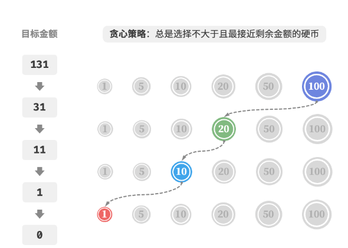

### 贪心法思想

​	基本思想是在问题的每个决策阶段，都选择当前看起来最优的选择，即贪心地做出局部最优的决策，以期获得全局最优解。

​	正如其名字一样，贪心法在解决问题的策略上目光短浅，只根据当前已有的信息做出选择。一旦做出选择，不管将来有什么结果，这个选择都不会改变。

与动态规划对比：

​	贪心算法和动态规划都常用于解决优化问题。它们之间存在一些相似之处，比如都依赖最优子结构性质，但工作原理不同。

- 动态规划会根据之前阶段的所有决策来考虑当前决策，并使用过去子问题的解来构建当前子问题的解。
- 贪心算法不会考虑过去的决策，而是一路向前地进行贪心选择，不断缩小问题范围，直至问题被解决。

### 举例-零钱兑换问题：

​	贪心算法实现简单，易于理解，效率也很高，但是具有局限性。

有一组不同面额的硬币，给定一个总金额 𝑎𝑚𝑡 ，计算并返回可以凑成总金额所需的最少的硬币个数 。

每次贪心的选择尽可能大的硬币（不大于总金额的最大硬币），直至凑出目标金额为止。

硬币组合[100、50、10、5、1]，总金额amt为131：

但是，某些情况下使用贪心是无法得到最优解的：

​	 硬币组合：[1,20,50]，总金额 𝑎𝑚𝑡=60 ，贪心算法只能找到 50+1×10 的兑换组合，共计 11 枚硬币，但动态规划可以找到最优解 20+20+20 ，仅需 3 枚硬币。

分析：

​	对于组合1、3、4，需要金额6，那么按照贪心法：4+1+1三个，而3+3两个即可。

​	如果硬币组合间有倍数关系，那么较大的硬币可以使用多个较小的硬币组合，意味着能用较小硬币的任意数量组合（加起来大于较大硬币），都可以直接使用较大硬币+一定数量的较小硬币替代去减少数量，不会出现3+3等于6，而4和3无法组合出6的这种情况。