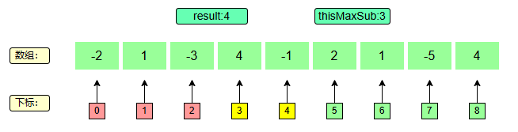

#### 问题描述：

​	给一个整数数组 ，请找出一个具有最大和的连续子数组（子数组最少包含一个元素），返回其最大和。

原始数组：

​		```nums = [-2,1,-3,4,-1,2,1,-5,4]```

#### 蛮力法：

​	 直接遍历所有情况，将任意情况下的最优解记录下来，取最大的

~~~ java
 public static int solution(int[] data, int n) {
        if (n < 0 || (n == 1 && data[0] <= 0)) {
            return 0;
        }
        if (n == 1) {
            return data[0];
        }
        int maxSum = 0, thisSum;
        // 计算i到i,i到i+1,...,i到n的和，选出最大的一个子序列。  
        // 当i从0遍历到n-1时，则计算过了所有的子序列
        for (int i = 0; i < n; i++) {
            thisSum = 0;// i 表示子序列左侧的位置
            for (int j = i; j < n; j++) { // j 表示子序列右边的位置
                // 汇总 i到j 的所有数之和时，对比solution1发现
                // 其实每次求和不需要都从i位置开始，因为 i到k的和 = i到K-1的和 + data[k]
                thisSum += data[j];
                maxSum = Math.max(maxSum, thisSum);
            }
        }
        return maxSum;
    }
~~~

#### 贪心法：

​	如果当前的子序列和小于0，那么负数+任何数都会变小，所以应该舍弃掉当前已经选择的子序列。

​	所以我们只需要考虑当前的最优解即可，不断向后遍历数组，直到遍历完数组就可以得到最大的子序列和。

**1、初始化**


**2、下标0**

​	下标为0，此时当前最大值变为$$0+(-2)=-2$$，然后结果取负无穷和-2之间较大的，即-2.

​	$$thisMaxSub = 0 + (-2) = -2$$

​	$$-2>负无穷 ~~推出~~ result = -2$$

​	因为-2为负数，一定会使后续的子序列和变小，直接舍弃。

​	$$-2<0 ~~推出~~ thisMaxSub = 0 $$


**3、下标1**

​	当前最大值变为$$0+1=1$$，然后结果取-2和1之间较大的，即1.

​	$$thisMaxSub = 0 +1= 1$$

​	$$1>-2 ~~推出~~ result = 1$$


**3、下标2**

​	当前最大值变为$$1+(-3)=-2$$，然后结果取1和-2之间较大的，即1.

​	$$thisMaxSub = 1 + (-3) = -2$$

​	$$1>-2 ~~推出~~ result =  1$$

​	因为-2为负数，一定会使后续的子序列和变小，直接舍弃。

​	$$-2<0 ~~推出~~ thisMaxSub = 0 $$


**4、下标3**

​	当前最大值变为$$0+4=4$$，然后结果取1和4之间较大的，即4.

​	$$thisMaxSub = 0 + 4 = 4$$

​	$$4>1 ~~推出~~ result =  4$$


**5、下标4**

​	当前最大值变为$$4+（-1）=3$$，然后结果取4和3之间较大的，即4.

​	$$thisMaxSub = 4 + （-1） = 3$$

​	$$4>3 ~~推出~~ result =  4$$



**6、下标5**

​	当前最大值变为$$3+2=5$$，然后结果取4和5之间较大的，即5.

​	$$thisMaxSub = 3+2=5$$

​	$$5>4 ~~推出~~ result =  5$$


....

​	最终得到最大值为6

~~~ java
    public static int execute(int[] data) {
        // result:存储最大值；thisMaxSub：存储当前最大值
        int result = Integer.MIN_VALUE, thisMaxSub = 0;
        for (int datum : data) {
            thisMaxSub += datum;
            result = Math.max(thisMaxSub, result);
            // tempMaxSub小于0的话，就可以直接舍弃掉，因为负数+任何数都会变得更小
            thisMaxSub = Math.max(thisMaxSub, 0);
        }
        return result;
    }
~~~

